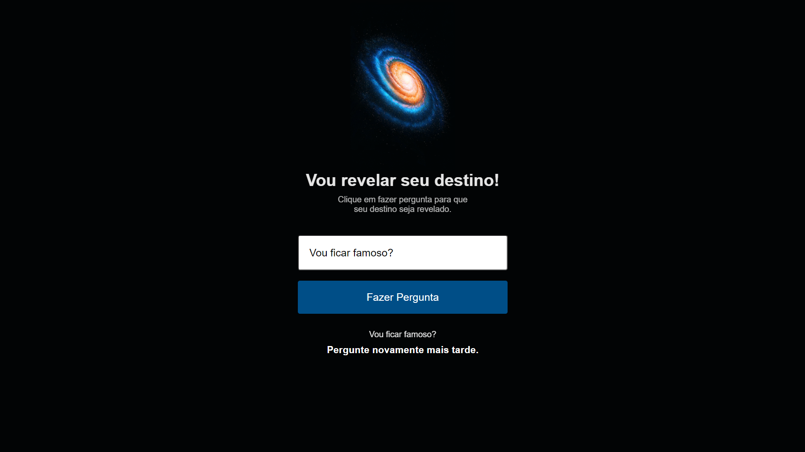

<h1 align="center">Random Answers 🔮</h1>

🚀 Perguntas e respostas! Ele irá adivinhar seu futuro!

 <a href="#objetivo">Objetivo</a> •
 <a href="#roadmap">Roadmap</a> • 
 <a href="#tecnologias">Tecnologias</a> •
 <a href="#React">React</a>

<h2 id="objetivo">✅ Objetivo </h2>

Me aprofundar mais em CSS, HTML, JS, React e Typescript para criação de futuros projetos frontend, acessivel e de fácil compreensão!!

<h2 id="roadmap">🐱‍🏍 Roadmap</h2>

    - [x] Criar HTML

    - [x] Criar CSS

    - [x] Criar JavaScript

    - [x] Cria projeto adaptado

    - [x] Adaptado para React JS

    - [x] Adaptado para React TS

<h1 align="center">
    
</h1>

Teste você mesmo!!🔎 https://maarcusvinicius.github.io/RandomAnswers/

<h2 id="tecnologias"> 🛠 Tecnologias </h2>

As seguintes ferramentas foram usadas na construção do projeto:

  
  
  
  
  

  

<h1 id="React"> Create React App </h1>

Create React apps with no build configuration.

- [Creating an App](https://pt-br.reactjs.org/docs/create-a-new-react-app.html) – How to create a new app.
- [User Guide](https://pt-br.reactjs.org/tutorial/tutorial.html) – How to develop apps with Create React App.

  

<h4 align="center"> 
	🚧  Random Answers 🔮 FINALIZADO  🚧
</h4>
 

Feito com ❤️ por Marcus Vinicius 👋🏽 Entre em contato!

  
  
  

 

  
#NextLevel
#NeverStopLearning
#NewSkills
#StepByStep
#MissionAccomplished

